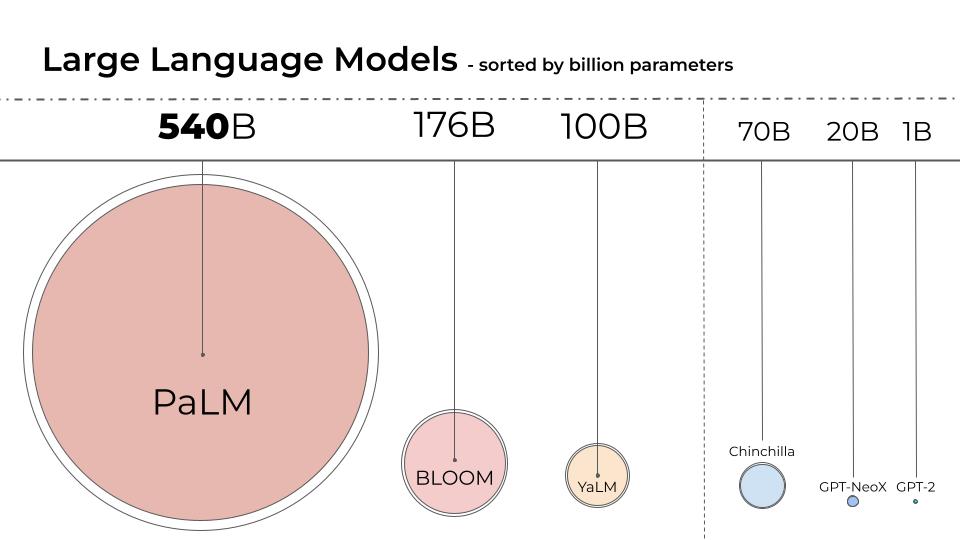
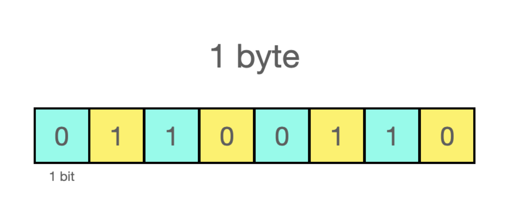
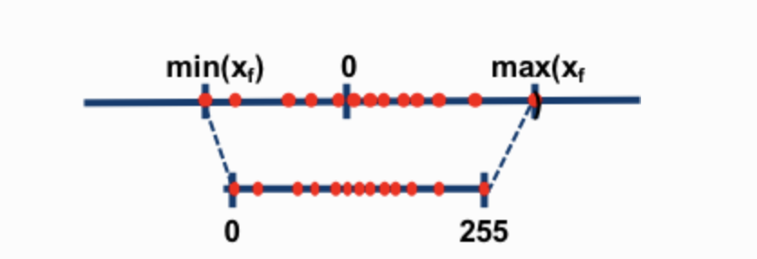

# A Gentle Introduction to 8-bit Matrix Multiplication for transformers at scale using transformers, accelerate and bitsandbytes

<div class="blog-metadata">
    <small>Published August 18, 2022.</small>
    <a target="_blank" class="btn no-underline text-sm mb-5 font-sans" href="https://github.com/huggingface/blog/blob/main/hf-bitsandbytes-integration.md">
        Update on GitHub
    </a>
</div>

<div class="author-card">
    <a href="/Younes">
        
        <div class="bfc">
            <code>Younes</code>
            <span class="fullname">Younes Belkada</span>
        </div>
    </a>
    <a href="/Tim">
        
        <div class="bfc">
            <code>Tim</code>
            <span class="fullname">Tim Dettmers</span>
            <span class="bg-gray-100 dark:bg-gray-700 rounded px-1 text-gray-600 text-sm font-mono">guest</span>
        </div>
    </a>
</div>

# Introduction

Language models are becoming larger: at the time of writing this blogpost, PaLM has 540B parameters, OPT, GPT-3 and BLOOM have around 176B parameters, and the current trend is still towards larger language models. Below is a qualitative diagram showing the size of some recent language models (original content).



Therefore these models are hard to run on easily accessible devices. To properly run BLOOM-175B you would need to have around 5-6 NVIDIA 80GB A100 GPUs , at ~$15k a piece.

While running an open-source version of PaLM would be even more expensive, we at Hugging Face will certainly want to host these even larger models, just as we did for BLOOM, OPT, YaLM, so that the community can benefit from these powerful models. 

Because these large models require a lot of resources to be run, it is a priotity to develop methods that allow us to run large models on less devices. To represent these large models faithfully however, we want to reduce the required number of devices and preserve performance at the same time – not an easy challenge for quantization and distillation approaches. Therefore, running these models on fewer devices with no performance degradation will be an open challenge for the next few years.


At Hugging Face and BigScience, while training BLOOM-176B we were interested in reducing the main model’s size with the least performance degradation possible. That is how we came out collaborating with bitsandbytes to integrate the recent “GPT3.int8(): 8-bit Matrix Multiplication for Transformers at Scale'' paper on transformers. We decided to integrate it since no post-training quantization is required to run this feature and you can reduce the memory footprint of the models by 2x for the largest models with few lines of code. Let’s understand in this blogpost how this method works in a nutshell and how to use it in transformers!

# A low level look

Let us start at the beginning. 

The size of the model is determined by the number of its parameters, and their precision, typically one of float32, float16 or bfloat16. 
Let’s imagine 1 bit as an available memory case to store a binary value (0 or 1), and 1 byte being a bigger memory case that can store 8 bits. With one byte we can make 2^8=256 different patterns. Usually, 256 different values offers too limited precision and one should store numbers in 2 bytes (float16 or bfloat16), 4 bytes (float32) or 8 bytes (float64) to get more precision - aka to cover more possible patterns and store very precise numbers. For example, 2 bytes can store 65536 patterns.




By default, most common Deep Learning models are stored in float32 - fp32 (4 bytes per parameter) but Large language models are usually stored in half-precision, so either fp16 or bf16 precision (2 bytes per parameter) since the performance gap between fp32 models and fp16 is relatively acceptable, and fp16/bf16 allows for faster training that requires less memory.


To calculate the model size in bytes one multiplies the number of parameters by the size of the chosen precision in bytes.  For instance, If we use the bfloat16 version of the BLOOM-176B model we have `176*10**9 x 2 bytes = 352GB`! As discussed earlier this is quite a challenge to fit into a few GPUs.
But what if we can store those weights using less memory using a different precision? A trick called quantization has been widely used in Deep Learning and let’s see how it works! 

# Quantizing models in a few words

How can we play with the precision of the parameters and reduce the model’s size? To improve accessibility for edge device applications, 8-bit quantization methods have been developed and widely used in Deep Learning. In other words, reducing the half-precision model’s precision into 8-bit (instead of 16-bit) leads to significant memory footprint reduction. 

Quantization is done by essentially “rounding” from one data type to another. For example, if one data type has the range 0..9 and another 0..4 then the value “4” in the first data type would be rounded to “2” in the second data type. However, if we have the value “3” in the first data type, it lies between 1 and 2 of the second data type and we would usually round to “2”. This shows that both value “4” and “3” of the first data type have the same value “2” in the second data type. This highlights, that quantization is a noisy process that can lead to degradation of the information stored. 

The most common types of 8-bit quantization techniques are zero-point quantization and absolute maximum (absmax) quantization. Zero-point quantization and absmax quantization maps the floating point values into more compact int8 (1 byte) values. What these methods do as a first step towards quantization is to normalize the input by scaling by a quantization constant. For example, if my range is -1.0…1.0 and I want to quantize into the range -127…127, I want to scale by the factor 127 before rounding to the 8-bit value. To retrieve back the original value you would just need to divide the int8 value by the quantization factor 127. For example, the value 0.3 would be scaled to 0.3*127 = 38.1. Through rounding we get the value of 38. If we reverse this, we get 38/127=0.2992 – we have a quantization error of 0.008 in this example. Those small errors can be accumulated and propagated across the model’s layers and lead to potential performance degradation. 



(Image taken from: [this blogpost](https://intellabs.github.io/distiller/algo_quantization.html) )

While the examples above were some toy examples, we now look at the details of absmax quantization. To calculate the mapping between the fp16 number and its corresponding int8 number in absmax quantization you have to first divide by the absolute maximum value of the tensor, and then multiply by the total range of the data type. For example, Int8 has a range of [-127, 127] and thus we scale by 127. For unsigned Int8, we would subtract the minimum and scale by the absolute maximum. This is close to what zero-point quantization does, a min-max scaling with the difference that zero-point quantization maintains scales the values in such a way that the value “0” is always represented by an integer without any quantization error.  To retrieve back the latest, one can just divide in full precision the int8 number with the quantization factor. 


These tricks can be combined in several ways, for example row-wise or vector-wise quantization when it comes to matrix multiplication for more accurate results. 

If you want to read more details about how classic quantization techniques work, we recommend to read this [blogpost](https://intellabs.github.io/distiller/algo_quantization.html), or read the GPT3.int8() paper (link).

While these basic techniques enable us to quantize transformers, they usually lead to a drop in accuracy. The bnb-int8 implementation that we integrated into our transformers and accelerate libraries is the first technique that does not degrade performance even for large models with 176B parameters, such as BLOOM. How does this work?


# Mixed int8 matrix multiplication for Large Language Models

In simple words, 8-bit Matrix multiplication at Scale for transformers aims to perform the computation of the matrix multiplication in 3 steps:
1. Given the input hidden states extract the column-wise outliers and non-outliers
2. Perform the matrix multiplication of the outliers in fp16 and the non-outliers in int8
3. Dequantize the non-outliers results and retrieve the full result in fp16
Let’s try here to understand these procedures step by step.


## What is an outlier in this case? 

In general, an outlier stands for a value that is outside the global distribution of some numbers. Given a set of numbers, the outlier is the number that is outside a certain pre-defined range. Outlier detection has been widely used and covered in the current literature and it happens that to perform robust outlier detection the empirical approach seems to be the best one. According to this paper, transformer-based architectures have a distribution such that ~99.9% of the values are inside the range [-6, 6]. 

## Inside the MatMul

Once the hidden states are computed we extract the outliers using a custom threshold (here we use 6.0) and we decompose the matrix in two parts as explained above. 
The outlier part is done in fp16 so it is a classic matrix multiplication whereas the 8bit matrix multiplication is done by quantizing the weights and hidden states using row-wise absmax quantization for the hidden states and column-wise absmax quantization for the weight matrix.
After this step the results are de-quantized and retrieved back in half precision to be able to add it to the first matrix multiplication.

## Why don’t we care about the bias term?

Simply because the output of this algorithm is in fp16 which is the same precision as the bias term!

## What does 0 degradation mean?

How can we properly evaluate the performance degradation of this method? How much quality do we lose in terms of generation when using 8-bit models?
We have ran several common tasks benchmarks with the 8-bit and native model using lm-eval-harness and reported the results:

| benchmarks | OPT-175B  | difference       |
| ---------- | --------- | ---------------- |
| name       | metric    | value - int8 - 6 | value - fp16 | err - int8 - 6 | err - fp16 | \- |
| hellaswag  | acc\_norm | 0.7849           | 0.7849 | 0.0041 | 0.0041 | 0 |
| hellaswag  | acc       | 0.5921           | 0.5931 | 0.0049 | 0.0049 | 0.001 |
| piqa       | acc       | 0.7965           | 0.7959 | 0.0094 | 0.0094 | 0.0006 |
| piqa       | acc\_norm | 0.8101           | 0.8107 | 0.0092 | 0.0091 | 0.0006 |
| lambada    | ppl       | 3.0142           | 3.0152 | 0.0552 | 0.0552 | 0.001 |
| lambada    | acc       | 0.7464           | 0.7466 | 0.0061 | 0.0061 | 0.0002 |
| winogrande | acc       | 0.7174           | 0.7245 | 0.0127 | 0.0125 | 0.0071 |

And the results on BLOOM-176:

| benchmarks | BLOOM176B | difference       |
| ---------- | --------- | ---------------- |
| name       | metric    | value - int8 - 6 | value - bf16 | err - int8 - 6 | err - bf16 | \- |
| hellaswag  | acc\_norm | 0.7274           | 0.7303 | 0.0044 | 0.0044 | 0.0029 |
| hellaswag  | acc       | 0.5563           | 0.5584 | 0.005 | 0.005 | 0.0021 |
| piqa       | acc       | 0.7835           | 0.7884 | 0.0096 | 0.0095 | 0.0049 |
| piqa       | acc\_norm | 0.7922           | 0.7911 | 0.0095 | 0.0095 | 0.0011 |
| lambada    | ppl       | 3.9191           | 3.931 | 0.0842 | 0.0846 | 0.0119 |
| lambada    | acc       | 0.6808           | 0.6718 | 0.0065 | 0.0065 | 0.009 |
| winogrande | acc       | 0.7048           | 0.7048 | 0.0128 | 0.0128 | 0 |


We indeed observe 0 performance degradation for those models since the absolute difference of the metrics are all below the standard error (except for BLOOM-int8 which is slightly better than the native model on lambada). For more detailed performance evaluation against state of the art approaches you may look closely at the paper!

## Is it faster than native models?

We benchmarked the inference speed of int8 models on different models, although we are close to having the same speed than the native model for large models (tested on BLOOM-176) the inference speed seems to be much slower than the native model on smaller models. 

| Model          | Number of parameters | Hardware     | Time per token in milliseconds for Batch Size 1 | Time per token in milliseconds for Batch Size 8 | Time per token in milliseconds for Batch Size 32 |
| -------------- | -------------------- | ------------ | ----------------------------------------------- | ----------------------------------------------- | ------------------------------------------------ |
| BLOOM-176-int8 | 176B                 | 4xA100 80GB  | 282                                             | 37.5                                            | 10.2                                             |
| BLOOM-176-bf16 | 176B                 | 8xA100 80GB  | 239                                             | 32                                              | 9.9                                              |
| BLOOM-176-int8 | 176B                 | 6xA100 40GB  | 365                                             | 46.7                                            | 12.4                                             |
| BLOOM-176-int8 | 176B                 | 5xA100 40GB  | 367                                             | 46.4                                            | oom                                              |
| BLOOM-176-bf16 | 176B                 | 14xA100 40GB | 285                                             | 36.5                                            | 10.4                                             |
| T5-11b | fp16  | 11B                  | 2xT4 15GB    | 11.7                                            | 1.7                                             | 0.5                                              |
| T5-11b | int8  | 11B                  | 1xT4 15GB    | 43.5                                            | 5.3                                             | 1.3                                              |
| T5-3b | fp32   | 3B                   | 2xT4 15GB    | 45                                              | 7.2                                             | 3.1                                              |
| T5-3b | int8   | 3B                   | 1xT4 15GB    | 312                                             | 39.1                                            | 10.2                                             |


# How to use it in transformers

## Hardware requirements

Some 8-bit operations are not supported on the CPU. bitsandbytes can be run on 8-bit tensor cores-supported hardwares, which are Turing and Ampere GPUs (RTX 20s, RTX 30s, A40-A100, T4+). For example, Google Colab GPUs are usually NIVIDIA T4 GPUs and the latest generation of GPUs does support 8-bit cores. Our demo is based on Google Colab so check it out below! 

## Installation

Just install the latest version of the libraries using the commands below (make sure that you are using python>=3.8) and run the commands below to try out 

```bash
pip install accelerate
pip install bitsandbytes
pip install git+https://github.com/huggingface/transformers.git
```

## Example demos - running T5 11b on a Google Colab

Checkout the Google colab demos for running 8bit models on a Google Colab using BLOOM-3b model ! https://colab.research.google.com/drive/1qOjXfQIAULfKvZqwCen8-MoWKGdSatZ4  
Or this demo for 8-bit T5-3b & T5-11b!
https://colab.research.google.com/drive/1YORPWx4okIHXnjW7MSAidXN29mPVNT7F?usp=sharing 
# Scope of improvements

Although this method seems to be great for large models, we have identified several scope of improvements that can be tackled in the future for better usage!

## Inference speed and slowing down on smaller models

We have noticed that we retain the same inference speed on the native model than on the mixed-8bit model for very large language models (BLOOM-176B). However this method can significantly slow down inference speed on small models (<6b parameters models) this is due to the various internal casting steps that occur inside each 8bit-Linear layer. 
As a future work, one could try to improve that and see how the inference speed can be reduced on small models, probably by avoiding the casting operations. 

## Saving 8-bit state dicts on the Hub

For now 8-bit state dicts cannot be pushed on the Hub and loaded directly into the 8-bit model. This is because the statistics (outliers) computed by the model are not stored and considered inside the state dict for now. We believe that being able to save that and push it on the Hub could help for better accessibility (e.g. loading a T5-large or T0pp on Google Colab without using a lot of CPU ram for weight loading). 
## CPU support

As stated in the beginning of this blogpost, CPU devices do not support B-bit cores. But can we overcome that? Being able to run this module on CPUs could also largely help in terms of accessibility and broader usage.  

## Scaling up on other modalities

For now very large models are mainly language models. Very large vision, audio and multi-modal models might become more accessible in the next few years therefore leveraging this method on these models might be an interesting thing to do for better accessibility.
